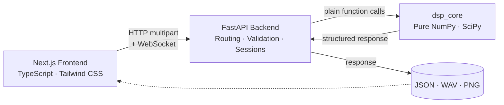

<div align="center">


<br/>


</div>

---

<div align="center">

### 👥 Project Team — Team Orion

**Level 2, Term 2 Sessional Project — CSE 220: Signals and Linear Systems**<br/>
Department of Computer Science and Engineering<br/>
Bangladesh University of Engineering and Technology (BUET)

| Name | Student ID |
|:---|:---:|
| MD Mahmudul Hossain Maahi | 2305150 |
| Md. Shihabul Hasan | 2305139 |

**Project Supervisor:** Md. Roqunuzzaman Sojib

</div>

---

<br/>

Rigel is a full-stack **digital signal processing platform** for audio — built to make the mathematics behind analysis, filtering, denoising, transformation, and voice activity detection visible and explainable, rather than hidden behind an opaque library call.

Every transform is implemented from first principles in a framework-independent Python core (`dsp_core`), exercised through a real-time Next.js interface, and backed by **709 automated backend tests**. Nothing here calls a black-box "denoise this" API — every coefficient can be seen, tuned, and reasoned about.

This project was developed as the **Level 2, Term 2 sessional project for CSE 220 — Signals and Linear Systems**, Department of Computer Science and Engineering, **Bangladesh University of Engineering and Technology (BUET)**.

<br/>

## Table of Contents

- [Overview](#overview)
- [Workspaces](#workspaces)
- [Architecture](#architecture)
- [Project Structure](#project-structure)
- [Getting Started](#getting-started)
- [Configuration](#configuration)
- [Testing and Quality](#testing-and-quality)
- [Tech Stack](#tech-stack)
- [Documentation](#documentation)
- [Roadmap](#roadmap)
- [License and Copyright](#license-and-copyright)

<br/>

<a name="overview"></a>

## Overview

| | |
|---|---|
| **Framework-independent core** | `dsp_core` is pure NumPy/SciPy — no FastAPI, no HTTP, no UI concerns. It could power a desktop application tomorrow without a single line changing. |
| **Educational, not a black box** | Classical statistical DSP (spectral subtraction, Wiener filtering, Log-MMSE, IMCRA/OM-LSA) — every algorithm's assumptions and limits are documented, not hidden behind a neural network. |
| **Real-time where it matters** | Live pitch/loudness measurement and voice activity detection stream over WebSockets with negotiated sample rates — no polling, no artificial delay. |
| **Lossless round-trips** | The Audio-to-Image codec (`RGL1` protocol) losslessly compresses and CRC32-checksums audio into a PNG data container, and back — bit-exact. |
| **Verified, not assumed** | 709 backend `pytest` cases cover edge cases, numerical correctness, and structural limits — not just "it ran without crashing." |

<br/>

<a name="workspaces"></a>

## Workspaces

Rigel is organized as ten progressive, complete modules — each a standalone workspace in the UI and a standalone package in `dsp_core`.

| # | Workspace | What it does |
|---|-----------|---------------|
| 01 | Project Foundation | FastAPI + Next.js skeleton, health/status API, CORS, versioned routing. |
| 02 | Audio Upload and Loading | WAV validation and decoding straight into NumPy — no persistence, no silent format coercion. |
| 03 | Waveform Visualization | Peak-envelope (min/max) decimation so transients survive at any zoom level. |
| 04 | Fourier Analysis | One-sided FFT magnitude spectrum in dBFS, with a from-scratch reference DFT for comparison. |
| 05 | Spectrogram / STFT | Hann-windowed short-time Fourier transform with a perceptually-ordered heat-map. |
| 06 | Digital Filtering | Butterworth, Chebyshev I/II, Elliptic, Bessel (IIR) and window-method/Parks-McClellan (FIR) — zero-phase via `sosfiltfilt`/`filtfilt`. |
| 07 | Noise Removal | Spectral Subtraction, Decision-Directed Wiener, Log-MMSE, and IMCRA + OM-LSA, on a unified STFT analysis/synthesis core. |
| 08 | Voice Activity Detection | Real-time speech/silence detection over a binary WebSocket session, with hot-swappable detection backends under the hood. |
| 09 | Voice Laboratory | A modular effect chain (Gain, Pitch Shift, Speed, Time-Stretch, Echo, Reverb, Chorus, Distortion) plus live pitch/loudness/BPM measurement. |
| 10 | Audio-to-Image Codec | Encode audio losslessly into a data-image PNG (`RGL1` protocol) and decode it back, CRC32-verified. |

<br/>

<a name="architecture"></a>

## Architecture



**Design principles:**

- The DSP core (`backend/dsp_core/`) accepts NumPy arrays and returns plain dataclasses — it has no idea FastAPI exists.
- Real-time features (VAD, live pitch/loudness) use raw WebSockets with an explicit JSON handshake to negotiate sample rate before any binary audio flows.
- Every offline transform (filtering, denoising, effects) is zero-phase or otherwise numerically accounted-for — no silent artifacts.
- The frontend never performs DSP math; it renders what the backend computed.

<br/>

<a name="project-structure"></a>

## Project Structure

```text
rigel/
├── frontend/                      # Next.js (App Router) + TypeScript
│   ├── src/app/
│   │   ├── page.tsx                 # Landing page
│   │   ├── docs/                    # In-app architecture & formula reference
│   │   └── playground/
│   │       ├── analysis/            # Waveform · Spectrum · Spectrogram
│   │       ├── filtering/           # IIR/FIR filter design & application
│   │       ├── enhancement/         # Noise removal
│   │       ├── speech/              # Voice Activity Detection
│   │       ├── voice-lab/           # Effect chain + live measurement
│   │       └── image/               # Audio-to-Image codec
│   ├── src/components/              # Audio widgets, layout, UI primitives
│   ├── src/contexts/                # Shared playground/session state
│   └── src/lib/                     # API client, docs content, shared types
│
├── backend/                       # FastAPI application + DSP core
│   ├── app/
│   │   ├── api/                     # Route handlers (routes.py, vad.py)
│   │   ├── models/                  # Pydantic request/response schemas
│   │   ├── services/                # Business logic per module
│   │   └── core/                    # Settings, CORS, app factory
│   ├── dsp_core/                    # Framework-independent DSP package
│   │   ├── waveform.py · spectrum.py · stft.py
│   │   ├── filtering.py · denoise.py
│   │   ├── measurement.py · pitch_shift.py · time_scale.py · effects.py
│   │   └── payload_protocol.py · image_codec.py · audio_codec.py
│   └── tests/                       # 709 pytest cases
│
├── assets/                        # README banner & visual assets
│   ├── banner.gif                   # Animated intro banner
│   └── banner.png                   # Static banner fallback
├── LICENSE
└── README.md
```

<br/>

<a name="getting-started"></a>

## Getting Started

### Prerequisites

- Python 3.11 or later
- Node.js 18.18 or later (with npm)
- Git

### 1. Clone the repository

```bash
git clone https://github.com/mahmudmaahi/Rigel.git
cd Rigel
```

### 2. Set up the backend

```bash
cd backend
python -m venv .venv

# Windows
.venv\Scripts\activate
# macOS / Linux
source .venv/bin/activate

pip install --upgrade pip
pip install -r requirements.txt

uvicorn app.main:app --reload --host 127.0.0.1 --port 8000
```

The API is now live at `http://127.0.0.1:8000`, with interactive Swagger docs at `http://127.0.0.1:8000/docs`.

### 3. Set up the frontend

In a second terminal, from the repository root:

```bash
cd frontend
npm install
npm run dev
```

Open `http://localhost:3000` — the frontend talks to the backend at `http://127.0.0.1:8000` by default.

> Both servers must be running simultaneously for the application to function — the frontend performs no DSP work on its own.

<br/>

<a name="configuration"></a>

## Configuration

Both applications ship with `.env.example` files — copy them to activate:

```bash
cp backend/.env.example backend/.env
cp frontend/.env.example frontend/.env.local
```

<details>
<summary><strong>backend/.env</strong> — optional overrides</summary>

| Variable | Default | Description |
|---|---|---|
| `RIGEL_APP_NAME` | `Rigel API` | Display name reported by `/api/status` |
| `RIGEL_MAX_AUDIO_UPLOAD_BYTES` | `20971520` (20 MB) | Upload size ceiling |

</details>

<details>
<summary><strong>frontend/.env.local</strong> — optional overrides</summary>

| Variable | Default | Description |
|---|---|---|
| `NEXT_PUBLIC_API_BASE_URL` | `http://127.0.0.1:8000` | Backend origin the frontend calls |

</details>

<br/>

<a name="testing-and-quality"></a>

## Testing and Quality

```bash
# Backend — 709 tests across all ten modules
cd backend
python -m pytest

# Frontend — lint, type-check, production build
cd frontend
npm run lint
npm run build
```

<br/>

<a name="tech-stack"></a>

## Tech Stack

<table>
<tr>
<td valign="top" width="50%">

**Frontend**


- Canvas-based waveform, spectrum, and spectrogram renderers
- AudioWorklet-driven microphone capture
- Raw WebSocket clients for real-time streams

</td>
<td valign="top" width="50%">

**Backend**


- Pydantic-validated request/response models
- Pure-function DSP core, zero framework coupling
- WebSocket sessions with explicit handshake protocols

</td>
</tr>
</table>

<br/>

<a name="documentation"></a>

## Documentation

Deep technical references — pipelines, algorithms, formulas, key files, and API contracts for each workspace — live inside the running application at `/docs` (for example `http://localhost:3000/docs/noise-removal` or `/docs/filtering`), with a dedicated page per workspace.

This README stays high-level on purpose; the in-app documentation is the source of truth for implementation detail.

<br/>

<a name="roadmap"></a>

## Roadmap

- [ ] Desktop application (reusing `dsp_core` as-is)
- [ ] Active noise cancellation
- [ ] Learned/adaptive enhancement models, benchmarked against the classical baselines
- [ ] Persistent session history

<br/>

<a name="license-and-copyright"></a>

## License and Copyright

Copyright (c) 2026 MD Mahmudul Hossain Maahi and Md. Shihabul Hasan (Team Orion). All rights reserved.

This repository was created for academic purposes as part of the CSE 220 (Signals and Linear Systems) sessional course at the Department of Computer Science and Engineering, Bangladesh University of Engineering and Technology (BUET). It is made available for educational reference and evaluation only.

No person or organization may copy, modify, distribute, sublicense, or deploy any part of this codebase for commercial purposes without prior written permission from the authors. See [`LICENSE`](LICENSE) for the full terms.

<br/>

<div align="center">

<sub>Built as an academic project — a laboratory for understanding audio DSP, not a production audio product.</sub>

</div>
